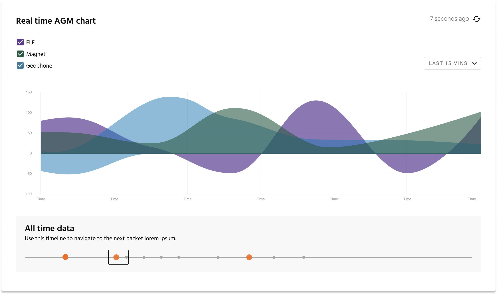

# pig-chart

An Angular chart library for displaying time series data.

## Functionality

This chart library is optimized for displaying time series data points on a line chart over a timeline that is traditionally difficult to see on a single screen. PigChart allows users to zoom into data to see data over milliseconds.

Here is a list of the features we support:

- Multiple lines on a single chart
- Legend that toggles each line on and off
- Select a "high-level" timeline
- Support real time data
- Show a timeline that allows users to select a smaller subset of the "high-level" timeline
- Highlight "major" sections in the timeline
- Highlight "minor" sections in the timeline
- Support multiple timeline views
- Support selecting multiple points on the time axis
- Support UTC to local time conversion
